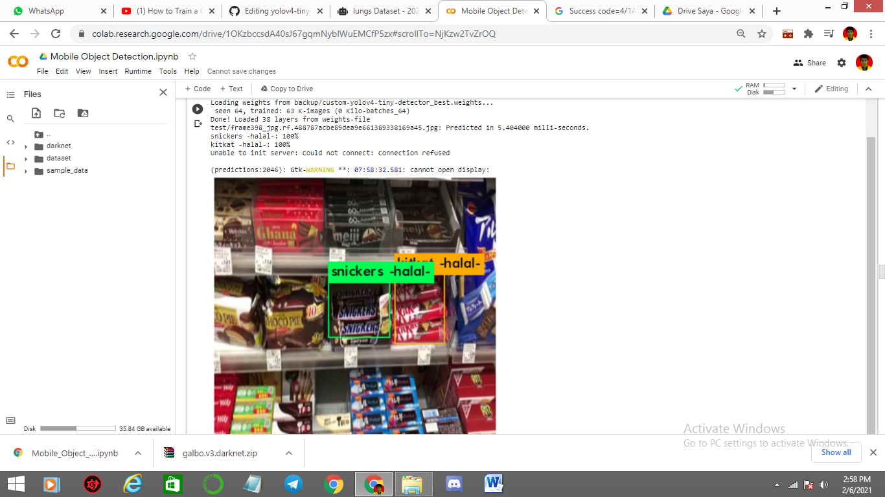
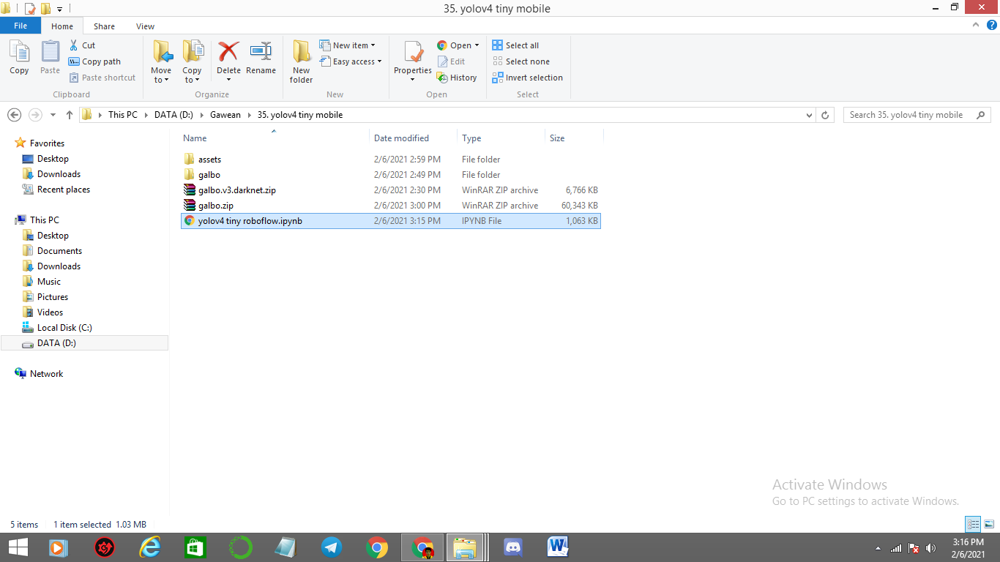
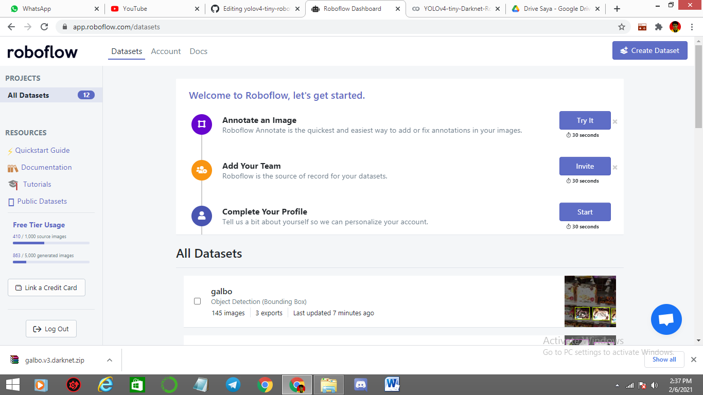
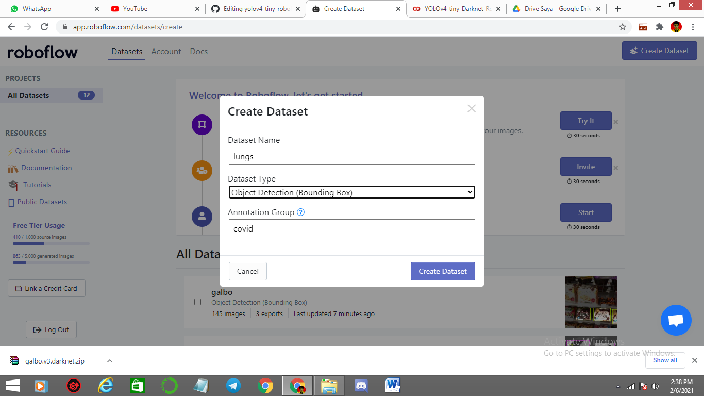
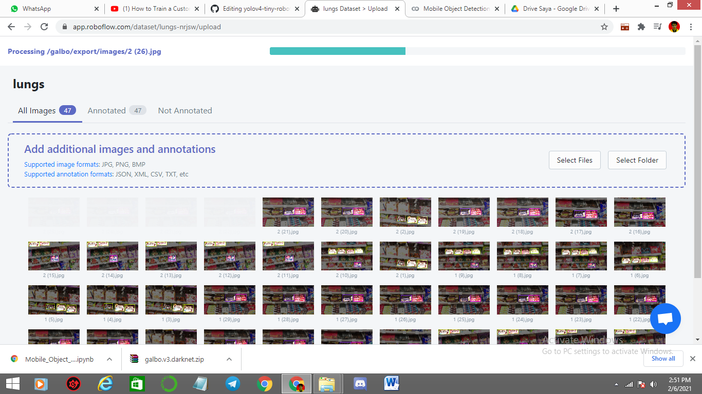
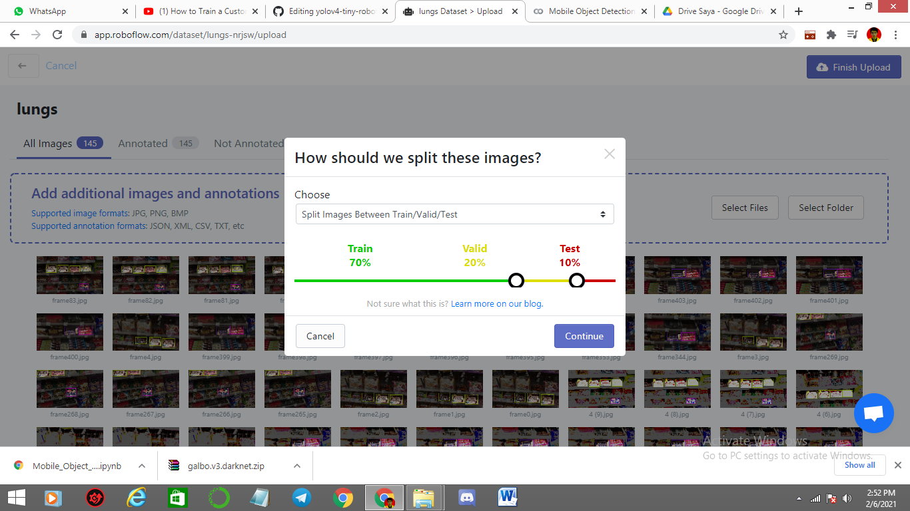
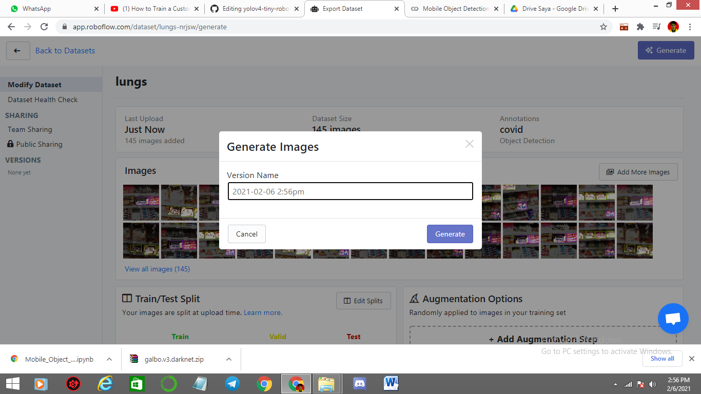
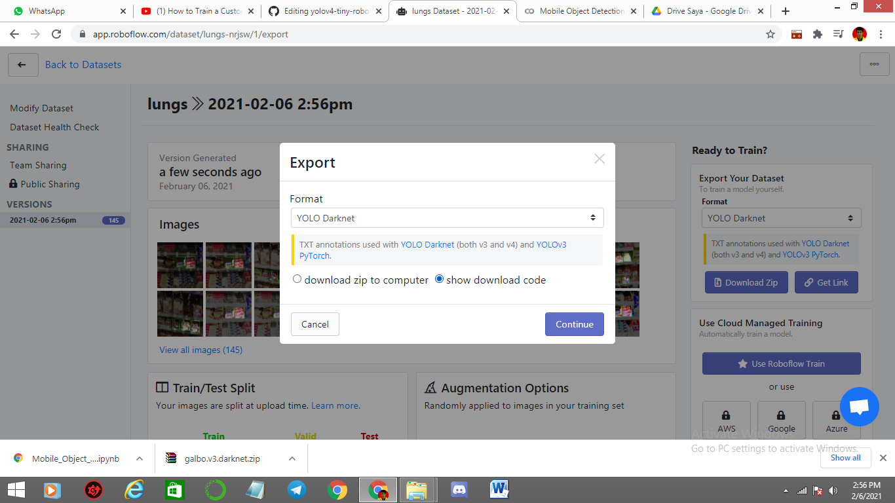
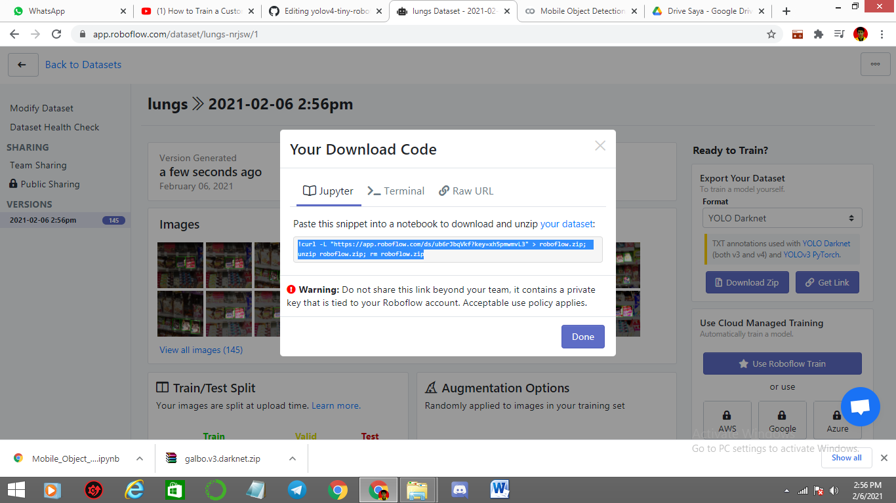

# yolov4-tiny-roboflow

This is an implementation of object detection tiny yolov4 using google colab

Dataset (Train) : 

The repository includes:
* Using roboflow to split dataset
* train yolov4 tiny
* testing on photo using yolov4 tiny

# Getting Started
Download this repo and dataset too, if u want use this dataset

* start from make custom dataset using roboflow 
* train and testing yolov4 using google colab

additional info :
Roboflow web ( https://app.roboflow.com/ ) || make your account first if u dont have account

# split dataset to train,test and validation using Roboflow

1. Download this repo and dataset : ( https://drive.google.com/file/d/1DqB2xLYCWnWeSjFgVw26OyugNgxI-CmX/view?usp=sharing ) then put the folder like this 

2.  open Roboflow web link : https://app.roboflow.com/ 

3. make account if u dont have it, and then click create dataset, then just fill the blank and choose object detection (cause this moment we will make object detection)

4.select folder galbo or drag it to roboflow web to insert dataset

5. after all data inserted then click finish upload, then u can split whatever u want. i use default config 70 20 10 (train,test,validation)

6. click continue and then u can fill again or just generate (doesnt matter what u do just generate it)

7. export the dataset and choose show the code 

8.just copy the code (we will use it later for train yolov4 tiny)

# Training on Your Own Dataset using yolov4 tiny

1. Make sure the path like this, and open this link : https://colab.research.google.com/notebooks/

* upload yolov4 tiny roboflow.ipynb to gcolab

2. change with your link where u got from roboflow, this is link dataset 

3. change the number of class, in this case i have 3 class (kitkat, snicker and galbo)

4. just execute the codes below, until testing code

# Testing

